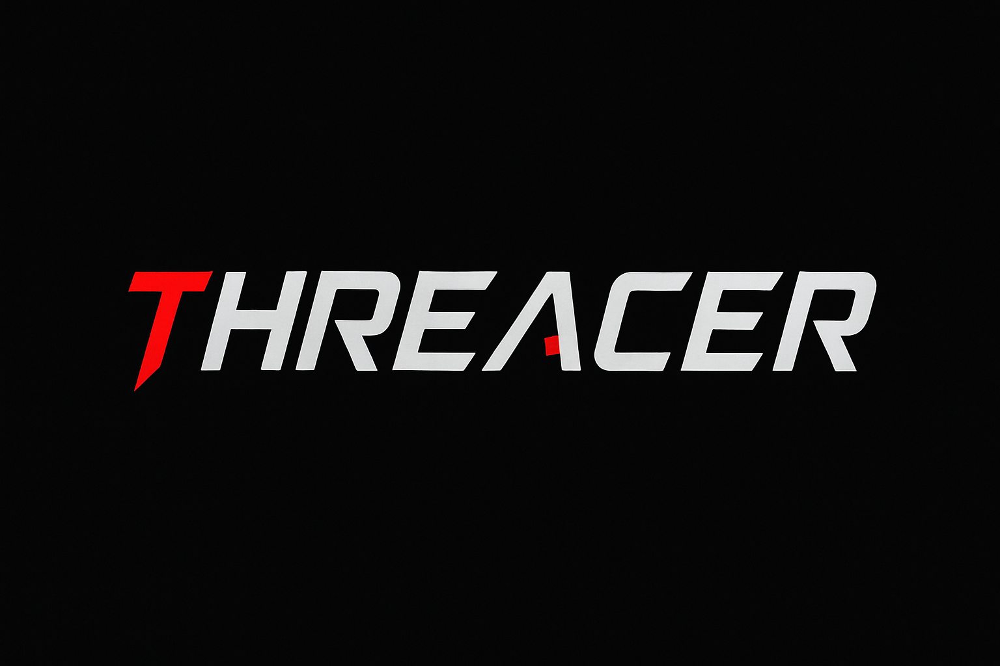

# Threacer - The Threat Tracer
Threacer is a proof of concept of a simple anti malware for Windows that emphasizes behavior-based detection.

## Why
> What I cannot create, I do not understand<br>
> _Richard Feynman_

As an offensive security professional wannabe, I want to dive deeper into the runtime detection techniques (aka "Robust detection") employed by modern EDRs.

Although this project does not aim to become a production ready tool, it is certainly useful as an educational project to understand the fundamentals behind the security system I try to evade in my day job. In addition, most publicly available antivirus projects focus on brittle detection (signature-based, artifact-focused) techniques.

Also, as a side effect, this project allows me to 
- explore Windows internals
- improve system programming skills
- introduce to kernel programming

## Architecture
The core architecture of Threacer is based on what is described during the Chapter 1 of "[Evading EDR: The Definitive Guide to Defeating Endpoint Detection Systems](https://nostarch.com/evading-edr)" by [Matt Hand](https://www.linkedin.com/in/handm/): it's composed of
- a userland agent service
- an hooking DLL
- a kernel mode driver
- a static scanner

The goal is to improve the architecture, add more telemetry sources and a more efficient detection logic incrementally, step by step.

### Userland Agent Service
`todo`

### Hooking DLL
Uses MS Detours to hook some Windows API calls:
- ntdll.dll
    - NtCreateUserProcess


The current hooked function's detour consists in a simple function that prints the called API on console and debugger (via `OutputDebugStringA`)

### Kernel Mode Driver
Needed to inject the Hooking DLL in every process spawned by the user.

Uses `PsSetCreateProcessNotifyRoutine` to get a callback on process creation. Inside the callback function, KAPC injection technique is used to inject the hooking DLL into the newly created process.

At the moment, it's just an hello world

## Build
### Hooking DLL
In order to build the Hooking DLL:
```powershell
.\build.bat
```
### Test Targets exe
```powershell
gcc -o test_target.exe test_target.c -luser32
```


## Development History
- 2025-10-4: Hooking of ntdll.dll PoC
- 2025-09-15: Hooking DLL PoC (taken from previous project "detraces")